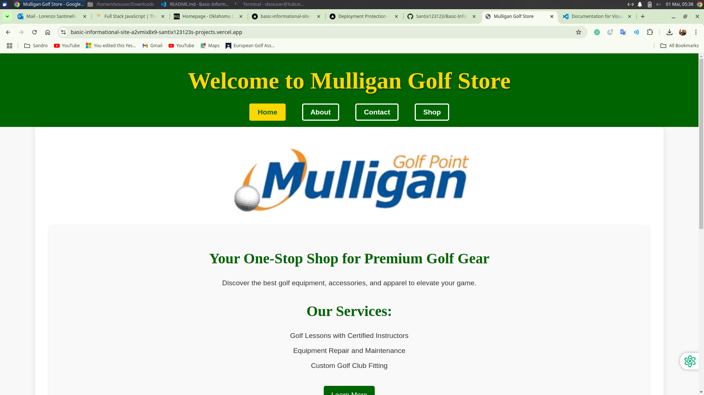
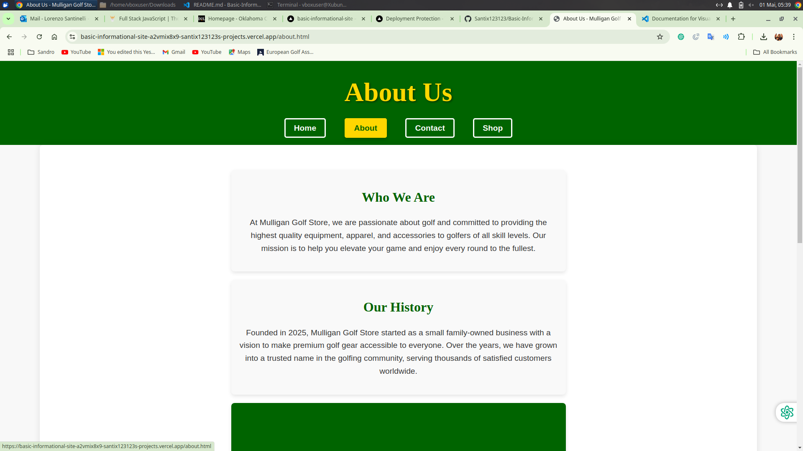
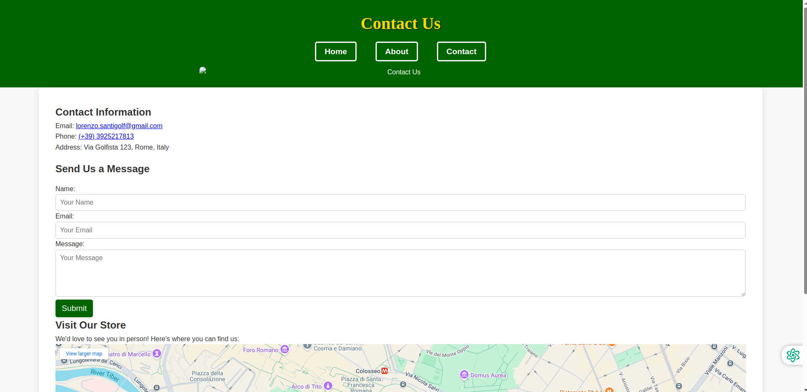

# Basic Informational Site

Welcome to the **Mulligan Golf Store** website! This project is a professional informational site for a golf store, showcasing products, services, and contact information. It is designed to provide a seamless user experience with a clean and modern interface.

---

## 📸 Screenshots (New screenshots added)

### Home Page


### About Page


### Contact Page


### Login Page


### Sign Me Up Page


### Shop Page


### Shopping Cart Page


---

## 🛠️ Technologies Used

- **HTML5**: For structuring the content.
- **CSS3**: For styling and layout.
- **JavaScript (Node.js)**: For serving the site and handling routing.
- **Google Fonts**: For modern typography.
- **Google Maps API**: For embedding the store's location.
- **LocalStorage**: For managing user authentication and shopping cart data.
- **VS Code**: As the development environment.

---

## ✨ Features

### Implemented Features
- **Home Page**: Displays a welcoming hero section, featured products, and services.
- **About Page**: Provides information about the store, its history, and team.
- **Contact Page**: Includes contact information, a contact form, and an embedded Google Map.
- **Product Catalog**: Displays products with filtering and sorting options.
- **Shopping Cart**: Allows users to add products to a cart, view cart items, and proceed to checkout.
- **User Authentication**: Includes login and signup functionality to restrict access to the shop page.
- **Responsive Design**: Optimized for both mobile and desktop devices.
- **Navigation Buttons**: Styled with hover effects and shadows.
- **Embedded Google Maps**: Displays the store's location.
- **Modern Typography**: Uses Google Fonts for a clean and professional look.

---

## 🚀 Installation Instructions

1. Clone the repository:
   ```bash
   git clone https://github.com/your-username/Basic-Informational-Site.git
   ```

2. Navigate to the project directory:
   ```bash
   cd Basic-Informational-Site
   ```

3. Install dependencies (if applicable):
   ```bash
   npm install
   ```

4. Start the server:
   ```bash
   node index.js
   ```

5. Open your browser and visit:
   ```
   http://localhost:8080
   ```

---

## 📖 Usage Guidelines

- Navigate through the site using the navigation bar.
- Explore the **Home**, **About**, and **Contact** pages for detailed information.
- Use the **Shop** page to browse products, filter by category, and sort by name or price.
- Add products to the shopping cart and proceed to checkout.
- Use the **Login** and **Sign Up** pages to access the shop.

---

## 🔮 Future Improvements

- Enhance accessibility for visually impaired users.
- Optimize performance for faster loading times.
- Add server-side authentication for improved security.
- Implement a payment gateway for the checkout process.
- Introduce user profiles for personalized shopping experiences.

---

## 🎓 Learning Outcomes

- Improved understanding of HTML and CSS for building responsive layouts.
- Gained experience with Node.js for serving static files and handling routing.
- Learned how to embed Google Maps and use external APIs.
- Enhanced skills in creating professional and user-friendly websites.
- Developed a deeper understanding of client-side storage and user authentication.

---

## 🌐 Live Demo

Check out the live demo here: [Mulligan Golf Store](https://b12d655d-274d-4944-80a8-a9982517d8cc-00-2qgv8861tjzqz.worf.replit.dev/)
````
