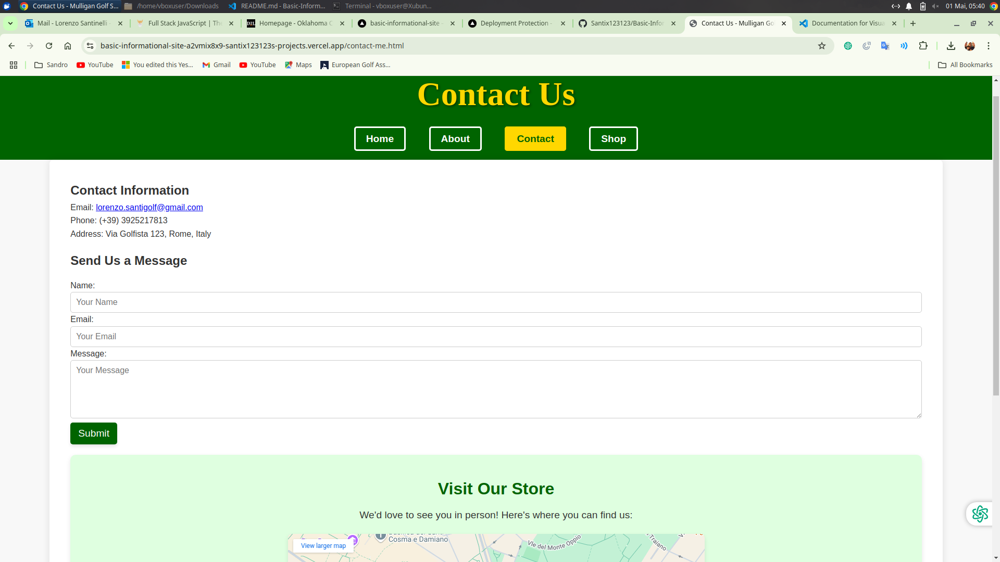

# Basic Informational Site

Welcome to the **Mulligan Golf Store** website! This project is a professional informational site for a golf store, showcasing products, services, and contact information. It is designed to provide a seamless user experience with a clean and modern interface.

---

## 📸 Screenshots

### Home Page


### About Page


### Contact Page


---

## 🛠️ Technologies Used

- **HTML5**: For structuring the content.
- **CSS3**: For styling and layout.
- **JavaScript (Node.js)**: For serving the site and handling routing.
- **Google Fonts**: For modern typography.
- **Google Maps API**: For embedding the store's location.
- **VS Code**: As the development environment.

---

## ✨ Features

### Required Features
- **Home Page**: Displays a welcoming hero section, featured products, and services.
- **About Page**: Provides information about the store, its history, and team.
- **Contact Page**: Includes contact information, a contact form, and an embedded Google Map.

### Additional Features
- Responsive design for mobile and desktop.
- Cool and professional yellow-themed headers.
- Navigation buttons styled with hover effects and shadows.
- Embedded Google Maps for the store's location.
- Clean and modern typography using Google Fonts.

---

## 🚀 Installation Instructions

1. Clone the repository:
   ```bash
   git clone https://github.com/your-username/Basic-Informational-Site.git

2. Navigate to the project directory:
    ```bash
    cd Basic-Informational-Site

3. Install dependencies (if applicable):
    ```bash
    npm install

4. Start the server:
    ```bash
    node index.js

5. Open your browser and visit:
    http://localhost:8080

---

## 📖 Usage Guidelines

- Navigate through the site using the navigation bar.
- Explore the **Home**, **About**, and **Contact** pages for detailed information.
- Use the contact form to send inquiries or feedback.

---

## 🔮 Future Improvements

- Add a product catalog with filtering and sorting options.
- Implement a shopping cart and checkout system.
- Add user authentication for personalized experiences.
- Enhance accessibility for visually impaired users.
- Optimize performance for faster loading times.

---

## 🎓 Learning Outcomes

- Improved understanding of HTML and CSS for building responsive layouts.
- Gained experience with Node.js for serving static files and handling routing.
- Learned how to embed Google Maps and use external APIs.
- Enhanced skills in creating professional and user-friendly websites.

---

## 🌐 Live Demo

Check out the live demo here: [Mulligan Golf Store](https://b12d655d-274d-4944-80a8-a9982517d8cc-00-2qgv8861tjzqz.worf.replit.dev/)